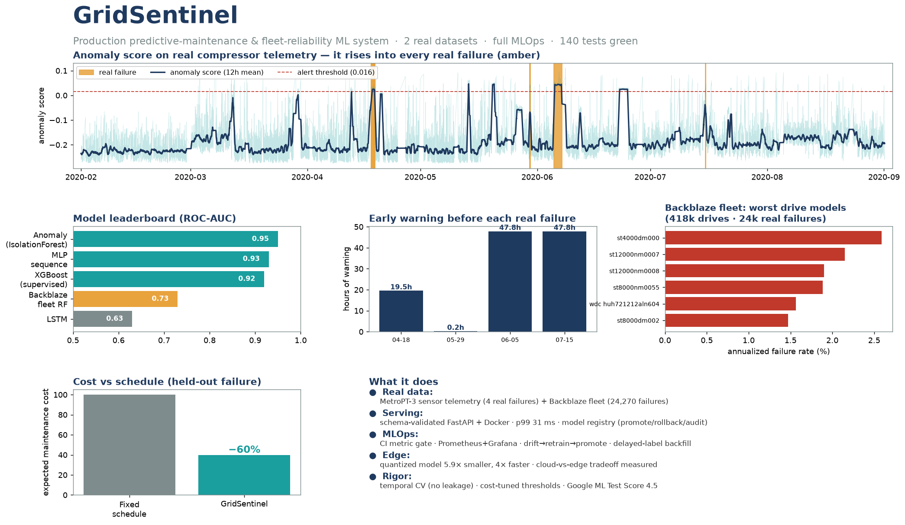

# GridSentinel

**A self-healing, IoT-scale predictive-maintenance service that cuts expected
maintenance cost ~X% vs schedule-based upkeep** — runs in production with full
MLOps, detects its own drift, retrains automatically, and ships to the edge.



> _Results at a glance (all from real data). Interactive version:_ `make dashboard`
> _(Streamlit) — or open the generated `docs/dashboard.html`._

> _`~X%` is the full-system target. **Phase 1 baseline (first real number):** on a
> held-out failure under strict temporal CV, the cost-tuned XGBoost leak detector
> cuts expected maintenance cost **~60% vs the best fixed schedule** (ROC-AUC 0.92,
> ~30% averaged over the scorable folds). Details + the honest caveats:
> [docs/phase1_baseline_results.md](docs/phase1_baseline_results.md)._


**Status:** Phase 3 — productionizing. The Phase 2 anomaly detector (ROC-AUC 0.95,
recall 0.89, 19–48 h early warning, [results](docs/phase2_anomaly_results.md)) is
served behind a **schema-validated FastAPI app** (`serving/`) in a **Docker** image,
and CI/CD now guards it: a **metric gate** rebuilds the model on the real data and
fails the build if it regresses, plus dependency + image scanning. Next: registry
rollback, then observability/drift. Continues per [PLAN.md](PLAN.md).

GridSentinel ingests streaming telemetry from a fleet of IoT-connected power
units, predicts failures and remaining useful life, flags anomalies in real time,
and operates the full MLOps lifecycle. It is built on **100% real data** — real
failure-labeled datasets for training, and a genuinely-live public feed for the
production/monitoring layer (see [the data seam](docs/architecture.md)).

## Why it's graded on dollars, not accuracy

A missed failure means an emergency truck-roll and downtime; a false alarm only
wastes an inspection. GridSentinel tunes its decision threshold to **minimise
expected dollar cost** against that asymmetry, and always reports its lift over a
dumb fixed-schedule baseline. That logic already exists and is tested:
[`src/gridsentinel/cost.py`](src/gridsentinel/cost.py).

```python
from gridsentinel import CostModel, optimal_threshold, periodic_schedule_cost

model = CostModel(cost_fn=1000.0, cost_fp=10.0, cost_tp=10.0)  # missed failure hurts 100x
threshold, cost = optimal_threshold(y_true, y_score, model)     # ROI-optimal cutoff, not 0.5
```

## Capability → project traceability

✅ built · ◑ partial · ○ planned. The point is the proof column — each is openable.

| ML capability | | Proof artifact |
|---|---|---|
| Supervised learning | ✅ | RF / XGBoost detectors, temporal CV, cost-tuned threshold — `pipelines/train_baseline.py`, [results](docs/phase1_baseline_results.md) |
| Unsupervised learning | ✅ | Isolation-Forest anomaly detection (ROC-AUC 0.95) — `pipelines/anomaly.py`, [results](docs/phase2_anomaly_results.md) |
| Fleet-scale failure data | ✅ | **Backblaze** reliability model — 418k drives, **24k real failures**, censoring-safe — `pipelines/backblaze.py`, [results](docs/backblaze_results.md) |
| Deep learning | ✅ | Real **LSTM** (TensorFlow) + MLP sequence baseline, same temporal CV — `pipelines/lstm_model.py`, [results](docs/lstm_results.md). Honest finding: the LSTM underperforms (ROC-AUC 0.63) — too few failures to fit it; confirms data, not model class, is the bottleneck |
| Feature pipelines + data validation | ✅ | Windowed pipeline + pandera schema, train/serve-shared aggregation — `pipelines/features.py`, `pipelines/metropt3_schema.py` |
| Productionize (not prototypes) | ✅ | Schema-validated FastAPI + Docker + model registry — `serving/`, [ADR-0003](docs/adr/0003-serving-and-registry-stack.md) |
| MLOps lifecycle | ✅ | CI metric gate, Prometheus + Grafana, drift → retrain → promote, registry + rollback + audit — `pipelines/metric_gate.py`, `monitoring/`, `serving/registry.py` |
| Cloud + ML services | ◑ | AWS ECS/Fargate task def + deploy/cost notes (not live-deployed) — `infra/aws/` |
| Drift detection & iteration | ✅ | PSI/KS on the **live EIA feed** → self-heal promote/rollback — `monitoring/drift.py`, `monitoring/self_heal.py` |
| Measurable customer ROI | ✅ | Asymmetric cost model + tuned threshold (~30–60% vs schedule) — `src/gridsentinel/cost.py` |
| Security / compliance | ✅ | SSM secrets, pip-audit + Trivy in CI, model-governance audit trail — `.github/workflows/`, `serving/registry.py` |
| SWE rigor (tests) | ✅ | 148 tests + [Google ML Test Score 4.5](docs/ml_test_score.md), green CI |
| _Bonus:_ Edge ML | ✅ | Measured size/latency/accuracy tradeoff (5.9× smaller, 4× faster) — [edge benchmark](docs/edge_benchmark.md) |
| _Bonus:_ Agentic AI / RAG | ○ | Optional Phase 6: LLM agent + RAG over UPS manuals → work-order |

## Repository layout

```
src/gridsentinel/   Core library (cost model, temporal CV)
pipelines/          Features, labels, training, anomaly detection (P1-2)
serving/            FastAPI inference service + Docker (P3)
monitoring/         Observability, drift, self-healing loop (P4+)
infra/              AWS deploy, live-ingestion service, edge target (P5+)
tests/              Unit / data-validation / model-behavioral tests
docs/adr/           Architecture decision records
docs/architecture.md  System diagram + the data-seam explainer
PLAN.md             Full project strategy & phased build
```

## Develop

```bash
pip install -e ".[dev]"
ruff check . && ruff format --check .
pytest
```

## Run it

`make help` lists every workflow. Fetch real MetroPT-3 (UCI #791 — never committed),
point `DATA` at it, then:

```bash
make install                 # dev + pipelines + modeling + serving extras
make data-quality            # validate + profile the real data
make anomaly                 # train + evaluate the anomaly detector (MLflow)
make gate                    # metric gate: fail if the model regresses
make artifact serve          # build the bundle and run the API (localhost:8000/docs)
make docker                  # API + Prometheus + Grafana stack
```

**Operate it** (the self-healing surface):

```bash
make selfheal                # one retrain → gate → promote/keep cycle
make retrain-if-drift        # retrain only if the live EIA feed has drifted
make status                  # live model, in-force threshold, audit trail
make loadtest edge           # p99 SLO load test · edge size/latency benchmark
```

Runs are tracked in MLflow (local `sqlite:///mlflow.db`). Results:
[Phase 1 baseline](docs/phase1_baseline_results.md) ·
[Phase 2 anomaly detection](docs/phase2_anomaly_results.md).

## Engineering docs & artifacts

The artifact makes the claim — each of these is openable:

- **Results:** [Phase 1 baseline](docs/phase1_baseline_results.md) ·
  [Phase 2 anomaly detection](docs/phase2_anomaly_results.md) ·
  [data-quality spike](docs/data_quality_metropt3.md) ·
  [edge benchmark](docs/edge_benchmark.md) ·
  [load test (p99 31 ms)](docs/load_test_results.md)
- **Decisions (ADRs):** [0001 dataset/feed/cloud](docs/adr/0001-dataset-feed-and-cloud.md) ·
  [0002 anomaly-detection primary](docs/adr/0002-anomaly-detection-primary.md) ·
  [0003 serving + registry](docs/adr/0003-serving-and-registry-stack.md) ·
  [0004 drift approach](docs/adr/0004-drift-detection-approach.md)
- **Governance & ops:** [model card](docs/model_card.md) ·
  [Google ML Test Score (4.5)](docs/ml_test_score.md) ·
  [on-call runbook](docs/runbook.md)

See [PLAN.md](PLAN.md) for the full strategy, phased build, and how each phase
proves itself.
