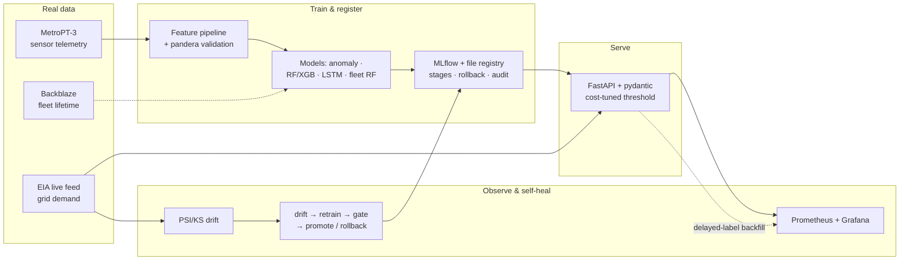

# GridSentinel

**A self-healing, IoT-scale predictive-maintenance service that cuts expected
maintenance cost up to ~60% vs schedule-based upkeep** — it runs the full MLOps
lifecycle, detects its own drift, retrains automatically, and ships to the edge, on
**100% real data**.

[](https://github.com/rpatel0022/gridsentinel-predictive-maintenance/actions/workflows/ci.yml)
[](LICENSE)


> **Live:** [interactive results board](https://rpatel0022.github.io/gridsentinel-predictive-maintenance/)
> (GitHub Pages) · run it locally with `make dashboard` · deploy your own copy in ~2 min —
> see [DEPLOY.md](DEPLOY.md).

---

## What it is

GridSentinel ingests streaming telemetry from a fleet of IoT-connected power units,
**predicts failures with early warning, flags anomalies in real time, serves those
predictions behind a validated API, and operates the entire ML lifecycle** — CI metric
gate, drift detection on a genuinely live feed, and a self-healing retrain → gate →
promote/rollback loop.

Every number in this repo comes from **real data** (no synthetic values): real
failure-labeled datasets for training, and a live public feed for the
production/monitoring layer. The two are deliberately different sources — see
[the data seam](docs/architecture.md#the-data-seam).

## Why it's graded on dollars, not accuracy

A missed failure means an emergency truck-roll and downtime; a false alarm only wastes an
inspection — an asymmetry of ~100×. GridSentinel tunes its decision threshold to
**minimize expected dollar cost** against that asymmetry, and always reports its lift over
a dumb fixed-schedule baseline. That logic is the spine of the project and is tested:
[`src/gridsentinel/cost.py`](src/gridsentinel/cost.py).

```python
from gridsentinel import CostModel, optimal_threshold, periodic_schedule_cost

model = CostModel(cost_fn=1000.0, cost_fp=10.0, cost_tp=10.0)  # a missed failure hurts 100x
threshold, cost = optimal_threshold(y_true, y_score, model)     # ROI-optimal cutoff, not 0.5
```

## How it works

The system is a pipeline from raw telemetry to a self-operating production service. Each
stage below names the module that implements it.



1. **Ingest & validate.** Telemetry is validated against a `pandera` contract with
   spike-derived physical bounds — bad readings are rejected at the door
   ([`pipelines/metropt3_schema.py`](pipelines/metropt3_schema.py),
   [`pipelines/data_quality.py`](pipelines/data_quality.py)). The live grid feed comes in
   through [`pipelines/connectors.py`](pipelines/connectors.py).
2. **Feature pipeline.** A windowed aggregation turns raw signals into features; the
   *same* function runs at train and serve time, so there's no train/serve skew
   ([`pipelines/features.py`](pipelines/features.py),
   [`pipelines/labels.py`](pipelines/labels.py)).
3. **Models.** An unsupervised **Isolation-Forest anomaly detector** is the primary model
   (learns "normal", flags deviation, gives early warning —
   [`pipelines/anomaly.py`](pipelines/anomaly.py)); **RF / XGBoost** supervised baselines
   ([`pipelines/train_baseline.py`](pipelines/train_baseline.py)); a real **LSTM** +
   MLP-sequence deep-learning track
   ([`pipelines/lstm_model.py`](pipelines/lstm_model.py),
   [`pipelines/sequence_model.py`](pipelines/sequence_model.py)); and a censoring-safe
   **fleet-reliability** model on Backblaze
   ([`pipelines/backblaze.py`](pipelines/backblaze.py)). All use **temporal CV with an
   embargo** to prevent leakage ([`src/gridsentinel/cv.py`](src/gridsentinel/cv.py)).
4. **Cost-tuned serving.** The chosen model is bundled with its threshold, feature order,
   and provenance ([`serving/model.py`](serving/model.py)) and served by a
   **schema-validated FastAPI** app — bad telemetry returns HTTP 422
   ([`serving/app.py`](serving/app.py)). A file-based **registry** handles stages,
   promotion, rollback, and an audit trail
   ([`serving/registry.py`](serving/registry.py)).
5. **Observe.** Two-tier metrics — model signals (score distribution, alert rate) and
   system signals (latency, validation errors) — at `/metrics`, scraped by Prometheus +
   Grafana ([`serving/metrics.py`](serving/metrics.py),
   [`monitoring/`](monitoring/)).
6. **Detect drift & self-heal.** PSI + two-sample KS on the live feed
   ([`monitoring/drift.py`](monitoring/drift.py)) gate a retrain → metric-gate →
   promote-or-keep cycle ([`monitoring/self_heal.py`](monitoring/self_heal.py),
   [`monitoring/drift_trigger.py`](monitoring/drift_trigger.py)). When real labels arrive
   late, [`monitoring/backfill.py`](monitoring/backfill.py) computes true performance.
7. **Guard & ship.** CI rebuilds the model on real data and **fails the build on
   regression** ([`pipelines/metric_gate.py`](pipelines/metric_gate.py)); the model is
   quantized for the edge with a measured size/latency tradeoff
   ([`serving/benchmark.py`](serving/benchmark.py)).

Full detail, diagrams, and the deployment topology: **[docs/architecture.md](docs/architecture.md)**.

## Results (all real data)

| Metric | Value | Source |
|---|---|---|
| Anomaly detector ROC-AUC / recall | **0.95 / 0.89** | [results](docs/phase2_anomaly_results.md) |
| Early warning | **19–48 h** before 3 of 4 failures | [results](docs/phase2_anomaly_results.md) |
| Cost vs fixed schedule | **~60%** lower (held-out failure; ~30% mean) | [results](docs/phase1_baseline_results.md) |
| Supervised XGBoost / MLP-sequence ROC-AUC | 0.92 / 0.93 | [P1](docs/phase1_baseline_results.md) · [seq](docs/sequence_model_results.md) |
| Fleet model (Backblaze) | 418k drives, **24k real failures**, ROC-AUC 0.73 | [results](docs/backblaze_results.md) |
| LSTM ROC-AUC (honest underperformance) | 0.63 — data-limited, not model-limited | [results](docs/lstm_results.md) |
| Serving p99 latency | **31 ms** (< 50 ms SLO) | [load test](docs/load_test_results.md) |
| Edge tradeoff | **5.9× smaller, 4× faster**, same AUC | [edge benchmark](docs/edge_benchmark.md) |
| Tests · Google ML Test Score | **148** · **4.5** | [ML Test Score](docs/ml_test_score.md) |

## Capability → proof traceability

✅ built · ◑ partial · ○ planned. The point is the proof column — each is openable.

| ML capability | | Proof artifact |
|---|---|---|
| Supervised learning | ✅ | RF / XGBoost detectors, temporal CV, cost-tuned threshold — `pipelines/train_baseline.py`, [results](docs/phase1_baseline_results.md) |
| Unsupervised learning | ✅ | Isolation-Forest anomaly detection (ROC-AUC 0.95) — `pipelines/anomaly.py`, [results](docs/phase2_anomaly_results.md) |
| Fleet-scale failure data | ✅ | **Backblaze** reliability model — 418k drives, **24k real failures**, censoring-safe — `pipelines/backblaze.py`, [results](docs/backblaze_results.md) |
| Deep learning | ✅ | Real **LSTM** (TensorFlow) + MLP sequence baseline, same temporal CV — `pipelines/lstm_model.py`, [results](docs/lstm_results.md). Honest finding: the LSTM underperforms (ROC-AUC 0.63) — too few failures to fit it; confirms data, not model class, is the bottleneck |
| Feature pipelines + data validation | ✅ | Windowed pipeline + pandera schema, train/serve-shared aggregation — `pipelines/features.py`, `pipelines/metropt3_schema.py` |
| Productionize (not prototypes) | ✅ | Schema-validated FastAPI + Docker + model registry — `serving/`, [ADR-0003](docs/adr/0003-serving-and-registry-stack.md) |
| MLOps lifecycle | ✅ | CI metric gate, Prometheus + Grafana, drift → retrain → promote, registry + rollback + audit — `pipelines/metric_gate.py`, `monitoring/`, `serving/registry.py` |
| Cloud + ML services | ◑ | AWS ECS/Fargate task def + deploy/cost notes (not live-deployed) — `infra/aws/` |
| Drift detection & iteration | ✅ | PSI/KS on the **live EIA feed** → self-heal promote/rollback — `monitoring/drift.py`, `monitoring/self_heal.py` |
| Measurable customer ROI | ✅ | Asymmetric cost model + tuned threshold (~30–60% vs schedule) — `src/gridsentinel/cost.py` |
| Security / compliance | ✅ | SSM secrets, pip-audit + Trivy in CI, model-governance audit trail — `.github/workflows/`, `serving/registry.py` |
| SWE rigor (tests) | ✅ | 148 tests + [Google ML Test Score 4.5](docs/ml_test_score.md), green CI |
| _Bonus:_ Edge ML | ✅ | Measured size/latency/accuracy tradeoff (5.9× smaller, 4× faster) — [edge benchmark](docs/edge_benchmark.md) |
| _Bonus:_ Agentic AI / RAG | ○ | Optional: LLM agent + RAG over equipment manuals → work-order |

## Repository layout

```
src/gridsentinel/   Core library — cost model + temporal CV (the ROI + leakage core)
pipelines/          Data validation, features, labels, training, anomaly, fleet, DL, metric gate
serving/            FastAPI inference service, model bundle, registry, edge benchmark, load test
monitoring/         Drift (PSI/KS), self-healing retrain loop, delayed-label backfill, Grafana/Prometheus
infra/              AWS ECS/Fargate deploy notes + cost model
reports/            Interactive dashboards (Streamlit app + static Plotly board) from committed assets
tests/              148 tests — unit, data-validation, model-behavioral, integration
docs/               Architecture, results, ADRs, model card, runbook, ML Test Score
.github/workflows/  CI (lint/format/tests/mypy/coverage), model-eval metric gate
index.html          Generated GitHub-Pages board (built by `make pages`)
```

## Quickstart

```bash
# Develop
pip install -e ".[dev]"
ruff check . && ruff format --check .
pytest

# Run (fetch real MetroPT-3, UCI #791 — never committed — and point DATA at it)
make install          # dev + pipelines + modeling + serving extras
make data-quality     # validate + profile the real data
make anomaly          # train + evaluate the anomaly detector (tracked in MLflow)
make gate             # metric gate: fail if the model regresses
make artifact serve   # build the bundle + run the API (localhost:8000/docs)
make docker           # full stack: API + Prometheus + Grafana

# Operate (the self-healing surface)
make selfheal         # one retrain → gate → promote/keep cycle
make retrain-if-drift # retrain only if the live EIA feed has drifted
make status           # live model, in-force threshold, audit trail
make loadtest edge    # p99 SLO load test · edge size/latency benchmark
```

`make help` lists every target. Runs are tracked in MLflow (`sqlite:///mlflow.db`).

## Tech stack

**ML:** scikit-learn (Isolation Forest, RF), XGBoost, TensorFlow (LSTM), pandas/NumPy ·
**Validation:** pandera · **Serving:** FastAPI, pydantic, Uvicorn, Docker ·
**MLOps:** MLflow (tracking + registry), GitHub Actions (metric gate, pip-audit, Trivy) ·
**Observability:** Prometheus + Grafana · **Dashboards:** Streamlit, Plotly · **Cloud:** AWS (ECS/Fargate + S3, documented).

## Engineering docs

The artifact makes the claim — each of these is openable:

- **Architecture:** [system design + data seam](docs/architecture.md)
- **Results:** [Phase 1 baseline](docs/phase1_baseline_results.md) ·
  [Phase 2 anomaly detection](docs/phase2_anomaly_results.md) ·
  [Backblaze fleet](docs/backblaze_results.md) · [LSTM](docs/lstm_results.md) ·
  [sequence model](docs/sequence_model_results.md) ·
  [data-quality spike](docs/data_quality_metropt3.md) ·
  [edge benchmark](docs/edge_benchmark.md) ·
  [load test (p99 31 ms)](docs/load_test_results.md)
- **Decisions (ADRs):** [0001 dataset/feed/cloud](docs/adr/0001-dataset-feed-and-cloud.md) ·
  [0002 anomaly-detection primary](docs/adr/0002-anomaly-detection-primary.md) ·
  [0003 serving + registry](docs/adr/0003-serving-and-registry-stack.md) ·
  [0004 drift approach](docs/adr/0004-drift-detection-approach.md)
- **Governance & ops:** [model card](docs/model_card.md) ·
  [Google ML Test Score (4.5)](docs/ml_test_score.md) ·
  [on-call runbook](docs/runbook.md) · [deployment guide](DEPLOY.md)

## License

Released under the [MIT License](LICENSE).
