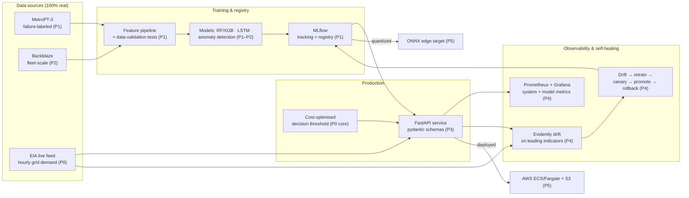

# GridSentinel — Architecture

> Phase 0 sketch. Components fill in as phases land; this diagram is the contract
> the build works toward. Boxes marked _(Pn)_ arrive in that phase.

## The data seam (read this before asking "where are the live labels?")

Two data tiers, two jobs — deliberately not one source pretending to be both:

- **Failure-labeled datasets** (MetroPT-3, Backblaze) **train and evaluate** the
  models. That is where ground-truth failures live.
- **The live EIA feed drives production/monitoring/retraining.** It has *no*
  failure labels, so the served model runs against it as a continuously-monitored
  stream with **absent/delayed ground truth**; true performance is backfilled if
  and when labels arrive. This is the realistic shape of operating ML in the
  field — see [ADR 0001](adr/0001-dataset-feed-and-cloud.md) and PLAN.md.
