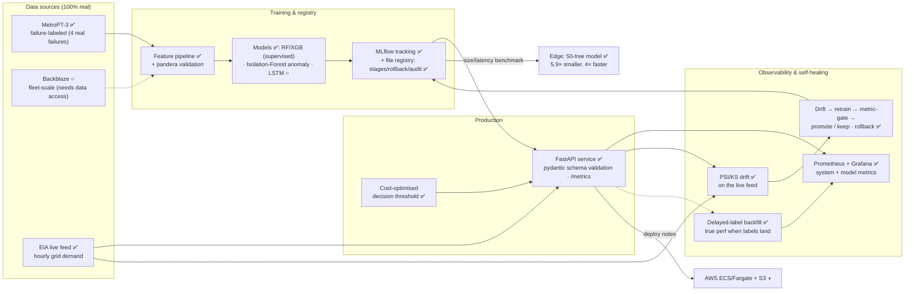

# GridSentinel — Architecture

> Reflects the **built** system (Phases 0–5). ✅ built · ◑ documented (not deployed
> from this repo) · ○ deferred follow-on.

CI/CD guards the loop: a **metric gate** (`pipelines/metric_gate.py`) rebuilds the
model on real data and fails the build on regression; **pip-audit** + **Trivy** scan
deps and image; the **load test** holds a per-request **p99 31 ms** SLO.

## The data seam (read this before asking "where are the live labels?")

Two data tiers, two jobs — deliberately not one source pretending to be both:

- **Failure-labeled data** (MetroPT-3; Backblaze when accessible) **trains and
  evaluates** the models. That is where ground-truth failures live.
- **The live EIA feed drives production/monitoring/retraining.** It has *no* failure
  labels, so the served model runs against it as a continuously-monitored stream with
  **absent/delayed ground truth**. The drift monitor watches leading indicators now;
  the **delayed-label backfill** (`monitoring/backfill.py`) computes true performance
  if and when labels arrive. This is the realistic shape of operating ML in the field
  — see [ADR 0001](adr/0001-dataset-feed-and-cloud.md) and PLAN.md.
