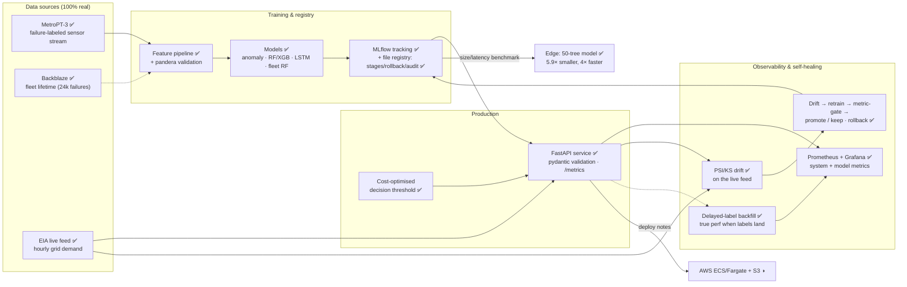
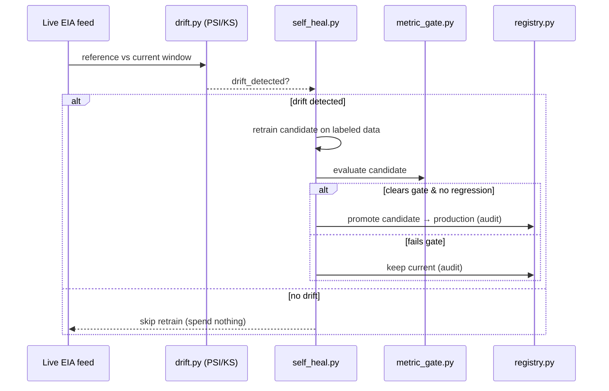

# GridSentinel — Architecture

This document explains how the system is built and how the pieces fit together. It
reflects the **built** system: ✅ built · ◑ documented (not deployed from this repo) ·
○ deferred follow-on.

## Contents

- [System overview](#system-overview)
- [Component breakdown](#component-breakdown)
- [The data seam](#the-data-seam)
- [The self-healing control loop](#the-self-healing-control-loop)
- [Serving & inference](#serving--inference)
- [Deployment topology](#deployment-topology)
- [Testing strategy](#testing-strategy)
- [Design decisions](#design-decisions)

## System overview

CI/CD guards the loop: a **metric gate** (`pipelines/metric_gate.py`) rebuilds the model on
real data and fails the build on regression; **pip-audit** + **Trivy** scan deps and image;
the **load test** holds a per-request **p99 31 ms** SLO.

## Component breakdown

Each package has one responsibility. CLI entry points are `python -m <module>` (wrapped by
`make` targets — see `make help`).

### `src/gridsentinel/` — core library

The two pieces every other module depends on, kept dependency-light and heavily tested.

- `cost.py` — the ROI core: `CostModel` (expected-dollar cost), `optimal_threshold`
  (cost-minimizing cutoff, not 0.5), and `periodic_schedule_cost` (the fixed-schedule
  baseline every result is measured against).
- `cv.py` — `temporal_splits`: time-ordered cross-validation with an **embargo** gap so no
  train/test window straddles the boundary (the leakage guard).

### `pipelines/` — data → models

- `metropt3_schema.py`, `backblaze_schema.py` — `pandera` contracts (types, physical
  ranges, monotonic timestamps). `data_quality.py` profiles the real data and provenances
  the range bounds.
- `connectors.py` — the EIA Open Data API client (the live feed).
- `features.py`, `labels.py` — windowed feature aggregation (shared by train **and** serve)
  and real failure labels from the maintenance report table.
- `train_baseline.py` — RF / XGBoost, cost-tuned threshold (train-tuned, test-frozen),
  MLflow tracking. `anomaly.py` — the primary Isolation-Forest detector.
  `sequence_model.py` / `lstm_model.py` — the MLP-sequence and real-LSTM deep-learning
  track. `backblaze.py` — censoring-safe fleet-reliability model.
- `metric_gate.py` — the CI gate: rebuild on real data, fail if metrics regress below
  committed floors.

### `serving/` — production inference

- `model.py` — the model **bundle** (pipeline + threshold + feature order + provenance),
  save/load, framework-free scoring core.
- `app.py` — FastAPI: `POST /predict`, `/health`, `/metrics`; every reading is
  pydantic-validated against the physical contract → bad telemetry is rejected with 422.
- `registry.py` — file-based **model registry**: production/candidate stages, promote,
  rollback, per-stage thresholds, and a governance **audit trail**.
- `metrics.py` — Prometheus instrumentation. `benchmark.py` — edge size/latency/accuracy.
  `load_test.py` — p99 SLO. `status.py` — operational status CLI.

### `monitoring/` — observability & self-healing

- `drift.py` — PSI + two-sample KS, dependency-light and deterministic. `eia_drift.py`
  runs it on the live feed.
- `self_heal.py` — drift → retrain candidate → metric-gate → promote **only if** it clears
  the gate and doesn't regress, else keep current. `drift_trigger.py` — runs that cycle
  **only when** drift is detected.
- `backfill.py` — recomputes true precision/recall/ROC-AUC once late labels arrive.
- `prometheus/`, `grafana/` — the auto-provisioned observability stack.

### `reports/` — dashboards

- `precompute.py` — turns the real data into small committed assets (`reports/assets/`).
- `app.py` — the Streamlit dashboard (reads the assets; deployable to Streamlit Cloud).
- `dashboard.py` — the static Plotly board + the GitHub-Pages page (`make pages` →
  root `index.html`).

### `infra/` — cloud target

AWS ECS/Fargate task definition, deploy guide, and a cost note (documented target, not
deployed from this repo).

## The data seam

Two data tiers do **two different jobs** — deliberately not one source pretending to be
both. This is the most important design decision to understand.

- **Failure-labeled data** (MetroPT-3; Backblaze at fleet scale) **trains and evaluates**
  the models. That is where ground-truth failure events live.
- **The live EIA feed drives production, monitoring, and retraining.** It has *no* failure
  labels, so the served model runs against it as a continuously-monitored stream with
  **absent / delayed ground truth**. The drift monitor watches leading indicators *now*;
  the delayed-label **backfill** (`monitoring/backfill.py`) computes true performance if and
  when labels arrive.

This mirrors how ML actually operates in the field — you rarely get live labels — and it
forces the monitoring layer to lead on *unlabeled* signals (drift, score distribution)
rather than accuracy. See [ADR 0001](adr/0001-dataset-feed-and-cloud.md).

## The self-healing control loop

Retraining always happens on the labeled Tier-1 data; drift on the unlabeled Tier-2 stream
is the *signal* that the model may be stale. Rollback is a first-class registry operation,
and every stage transition is written to the audit trail. On-call procedures:
[runbook](runbook.md).

## Serving & inference

The model is served as a self-contained **bundle** so serving never re-derives features
differently from training (`features.aggregate_window` is shared). Requests are validated
by pydantic against the same physical contract used at ingest, so malformed telemetry is
rejected with **HTTP 422** rather than silently scored. The decision threshold is the
cost-optimal one from `cost.py`, carried in the bundle. Measured **p99 latency is 31 ms**
(< 50 ms SLO); scoring is GIL-bound (~40 rps/process), so scale is horizontal — see the
[load test](load_test_results.md).

## Deployment topology

- **Local / demo:** `make docker` brings up API + Prometheus + Grafana via
  `docker-compose.yml`. `make serve` runs just the API at `localhost:8000/docs`.
- **Results dashboards:** the static board deploys to **GitHub Pages** (branch-served
  root `index.html`, built by `make pages`); the interactive Streamlit app deploys to
  **Streamlit Community Cloud** ([DEPLOY.md](../DEPLOY.md)).
- **Cloud (documented ◑):** AWS ECS/Fargate + S3 — task definition, deploy guide, and a
  ~$35–40/mo cost note in [`infra/aws/`](../infra/aws/).
- **Edge (✅):** the ensemble is shrunk (300→50 trees) for **5.9× smaller, ~4× faster**
  inference at the same ROC-AUC — see the [edge benchmark](edge_benchmark.md).

## Testing strategy

- **Lean CI gate** installs only `.[dev,pipelines]` and runs the numpy/pandas-only tests;
  heavier tests (`sklearn`, `scipy`, `tensorflow`, `plotly`) skip via `importorskip`, so
  the gate stays fast and green. Lint (`ruff`), format, and `mypy` run here too.
- **Advisory coverage job** installs the full extras and runs the whole suite with
  `pytest --cov` for a real coverage number (non-blocking — never red-gates the badge).
- **148 tests** across unit, data-validation, model-behavioral (CheckList-style), and an
  end-to-end integration test. Self-assessed against Google's
  [ML Test Score](ml_test_score.md) (4.5).

## Design decisions

Every significant fork is recorded as an ADR:

- [0001 — dataset, live feed, cloud](adr/0001-dataset-feed-and-cloud.md)
- [0002 — anomaly detection as the primary model](adr/0002-anomaly-detection-primary.md)
  (and why calibration was rejected)
- [0003 — serving + file-registry stack](adr/0003-serving-and-registry-stack.md)
- [0004 — in-house PSI/KS drift over a framework](adr/0004-drift-detection-approach.md)
